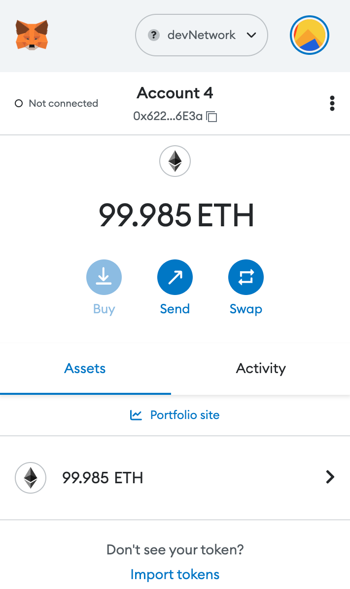
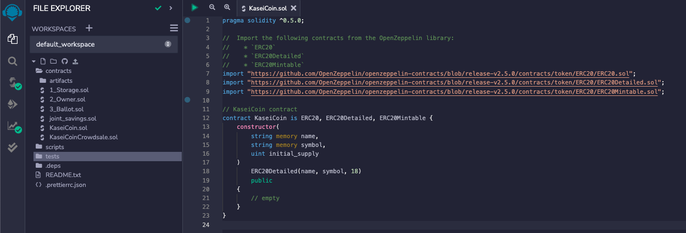
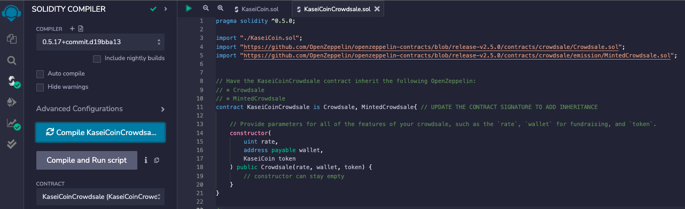
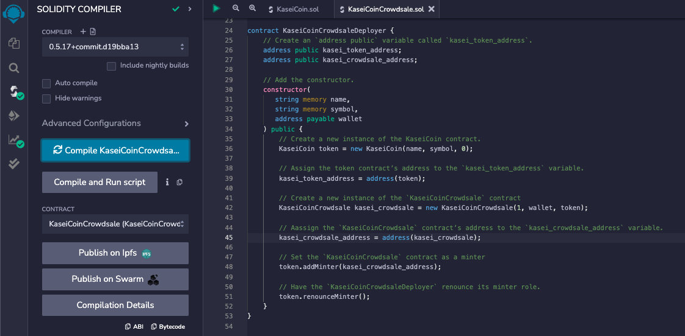

# Kasei Coin


---

## Description
This project aims to create a new ERC-20 token named KaseiCoin (KCOIN) and provide a time period and goal for crowdsale of the token. The writing of the contracts is done using [Remix](https://remix-project.org/).  The testing of the contract via a blockchain is done using [Ganache](https://trufflesuite.com/ganache/). The wallet used to purchase tokens and sign transactions is [MetaMask](https://metamask.io/).

The first step is to create a test network in [MetaMask](https://metamask.io/). Once this is complete, we want to add to accounts that will be able to interact with this test network. This is done by importing accounts into [MetaMask](https://metamask.io/) via private keys from [Ganache](https://trufflesuite.com/ganache/). Once this is complete, you should have something that looks like the following image (default ETH value is usually 100 ETH):



Once this is complete, we now need to test our contracts. The first contract `KaseiCoin` is compiled and we can see it successfully compiles with no errors:


Next, we want to ensure our `KaseiCoinCrowdsale` contract compiles successfully, which is shown below:


Next, we want to ensure our `KaseiCoinCrowdsaleDeployer` contract compiles successfully, which is shown below:



---

## Table of Contents
- [Kasei Coin](#kasei-coin)
  - [Description](#description)
  - [Table of Contents](#table-of-contents)
  - [1. Installation](#1-installation)
  - [2. Usage](#2-usage)
  - [3. License](#3-license)
  - [4. Contributing](#4-contributing)
  - [5. Tests](#5-tests)
  - [6. Deployment](#6-deployment)
  - [7. Contact](#7-contact)

---

## 1. Installation

  If you would like to clone the repository, type `git clone https://github.com/kheller18/kasei-coin.git`. Refer to the [Usage](#2-usage) section for required packages

---

## 2. Usage

  After cloning the repository locally, you'll need to have the packages listed in [Installation](#1-installation) installed on your machine. To do so, you'll need to activate your conda dev environment and running the following commands:
  * There are no additional packages that need to be installed.

  After all of these are installed, please refer to the [Deployment](#6-deployment) section for instructions on how to view or edit the notebook.

---

## 3. License
  ```
  MIT License

  Copyright (c) 2023 Keenan Heller

  Permission is hereby granted, free of charge, to any person obtaining a copy
  of this software and associated documentation files (the "Software"), to deal
  in the Software without restriction, including without limitation the rights
  to use, copy, modify, merge, publish, distribute, sublicense, and/or sell
  copies of the Software, and to permit persons to whom the Software is
  furnished to do so, subject to the following conditions:

  The above copyright notice and this permission notice shall be included in all
  copies or substantial portions of the Software.

  THE SOFTWARE IS PROVIDED "AS IS", WITHOUT WARRANTY OF ANY KIND, EXPRESS OR
  IMPLIED, INCLUDING BUT NOT LIMITED TO THE WARRANTIES OF MERCHANTABILITY,
  FITNESS FOR A PARTICULAR PURPOSE AND NONINFRINGEMENT. IN NO EVENT SHALL THE
  AUTHORS OR COPYRIGHT HOLDERS BE LIABLE FOR ANY CLAIM, DAMAGES OR OTHER
  LIABILITY, WHETHER IN AN ACTION OF CONTRACT, TORT OR OTHERWISE, ARISING FROM,
  OUT OF OR IN CONNECTION WITH THE SOFTWARE OR THE USE OR OTHER DEALINGS IN THE
  SOFTWARE.
  ```

---

## 4. Contributing

  + [Keenan Heller](https://github.com/kheller18)

---

## 5. Tests

  + There are currently no tests associated with this project.

---

## 6. Deployment
  + There is currently no live deployment of this app on a common server. To be able to run this app, upload the `KaseiCoin.sol` and `KaseiCoinCrowdsale.sol` files into [Remix IDE](https://remix-project.org/). Next, compile the contract and deploy it. Upon successful deployment, you will be able to test the functions of the contract.

---

## 7. Contact

  + [Keenan's LinkedIn](https://www.linkedin.com/in/keenanheller/)

---
